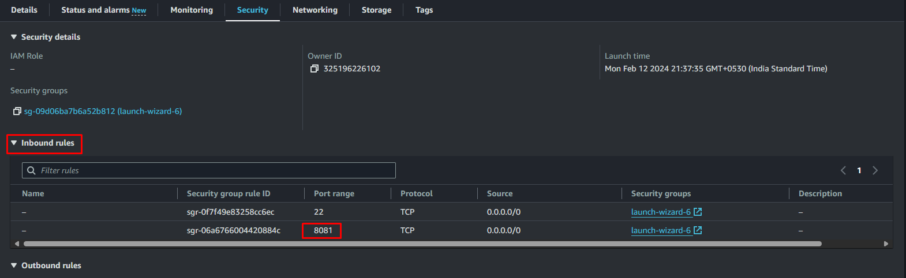

# Getting Started with 2048

This game (2048) was built using **React** and **TypeScript**. The unique part of this example is animations. The animations in React aren't that straightforward, so I hope you can learn something new from it.

**Wondering how was that built?** You can find a video tutorial on [ YouTube Channel](https://www.youtube.com/channel/UCJV16_5c4A0amyBZSI4yP6A)

## How To Play?

Have to run below command after publishing docker image to docker registry

Clone Link: 

```
https://github.com/chaitanya-online/2048-game.git
```

After Cloning this Repo in EC2 Instance 
Have To build it by using 

```
docker build -t richeb/2048-game .
```
If You want to Push Image to Docker Hub Registery use your docker.io username instead of richeb
then push it to docker hub using below command

```
docker push richeb/2048-game
```

Use Below command to run the container out of image

```
docker run -p 8081:3000 richeb/2048-game
```

Access The Application by using 

EC2 public Ip :8081

Note:-  Make Sure Your Ec2 Inbound rule allowed to 8081 port 



-------

If we want to Run in Local Machine By using Minikube PL refer below Repo

```
https://github.com/chaitanya-online/minikube-windows
```
